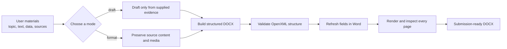
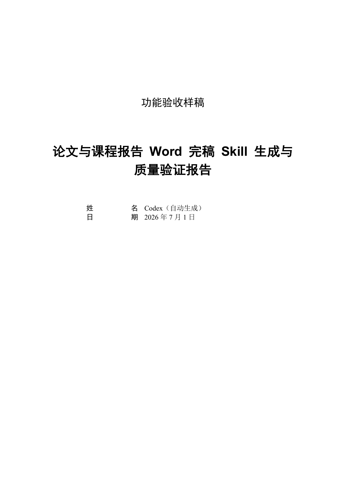
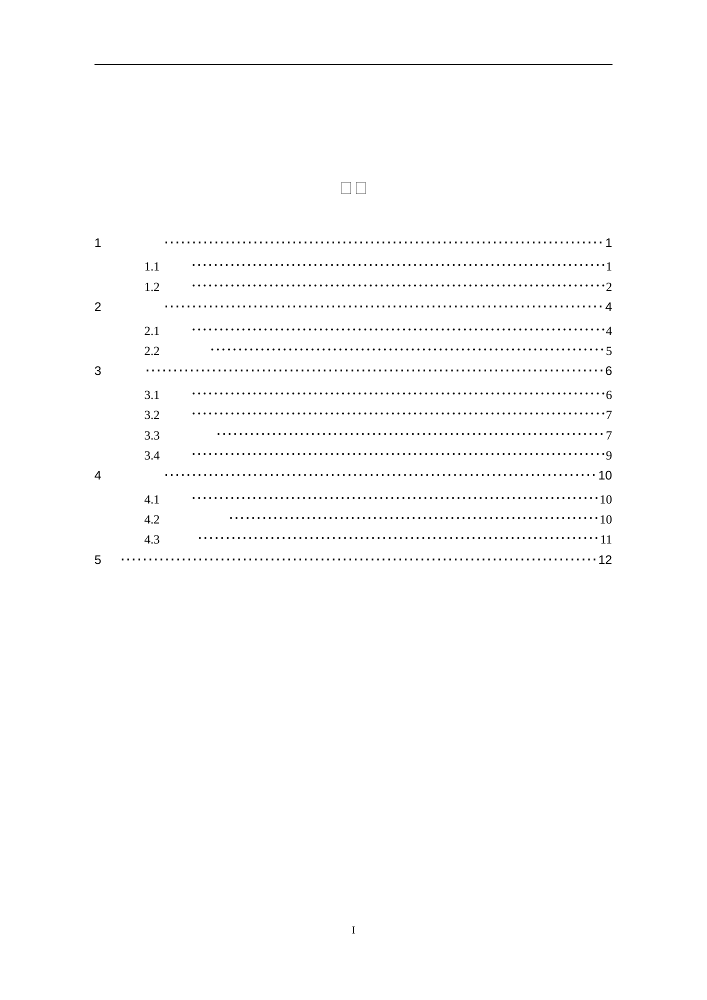
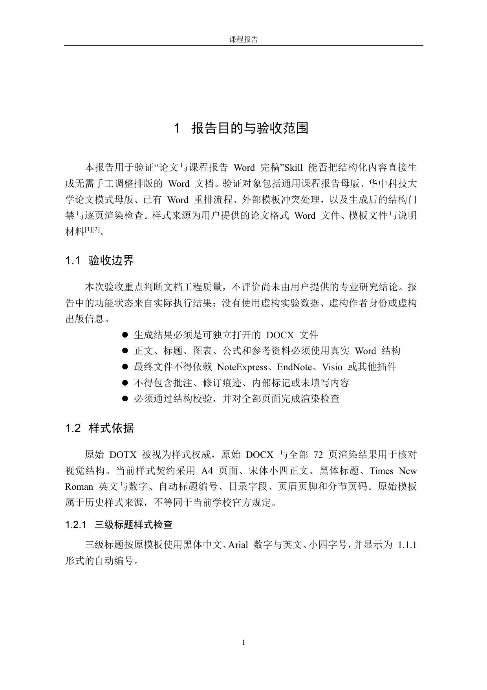
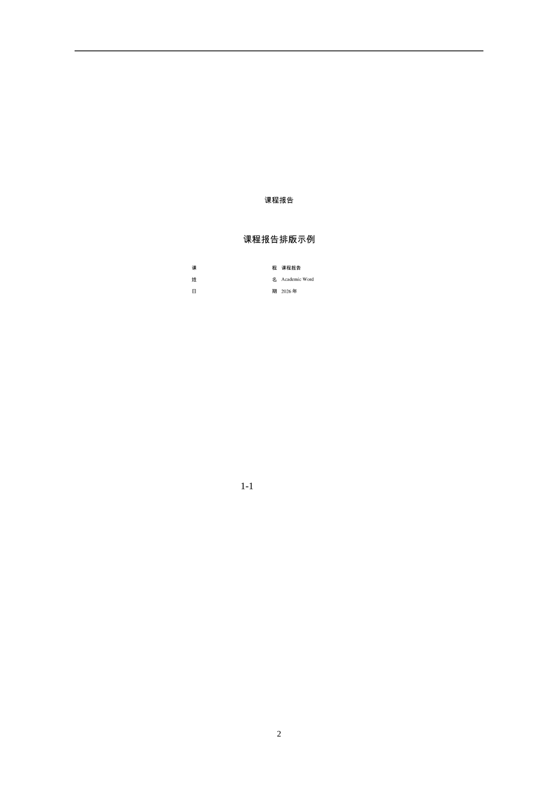
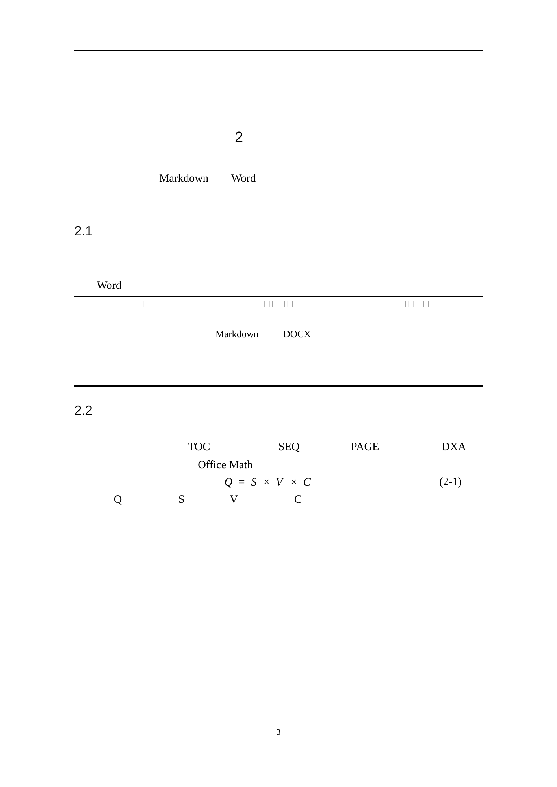

# Academic Word Codex Skill

[中文](README.md)

[](https://github.com/dongtingshuo/academic-word-codex-skill/actions/workflows/validate.yml)
[](https://www.python.org/)
[-315b4a.svg)](LICENSE)

A Codex skill for Chinese academic papers, theses, and course reports. It turns user-supplied topics, evidence, citations, assets, and existing Word documents into submission-ready `.docx` files with structural validation and page-by-page visual QA.

> **This skill is not limited to Huazhong University of Science and Technology.** The default mode is a school-neutral course report suitable for other universities, training courses, lab reports, and general academic reports. HUST thesis formatting is an optional mode that must be explicitly selected.


## Capabilities

- `draft`: create a complete Word document from a topic, outline, factual material, and sources.
- `format`: preserve the text, tables, images, equations, and links in an existing manuscript while applying the accepted format.
- Use native Word styles, four-level numbering, TOC fields, captions, cross-references, OMML equations, and section-based page numbering.
- Show only Heading 1 and Heading 2 in the TOC while retaining automatic Heading 3 and Heading 4 numbering in the body.
- Use GB/T 7714—2015 numeric citations by default, with superscript square-bracket citations in the body.
- Use a generic course-report shell by default; HUST-specific front matter is enabled only when `hust_thesis` is explicitly selected.
- Validate styles, numbering, citations, captions, page numbering, repeating table headers, note parts, placeholders, revisions, and non-portable objects.

## Workflow



Any structural error blocks delivery. Experimental data, author metadata, DOIs, and references must come from user materials or verified sources.

## Generated Output

The pages below come from one end-to-end acceptance report generated by the skill, structurally validated, and exported natively by Microsoft Word. They are not design mockups.

| Cover | Automatic TOC (Heading 1 and Heading 2 only) |
| --- | --- |
| [](docs/images/sample-cover.png) | [](docs/images/sample-toc.png) |

| Four heading levels, citations, and lists | Figure with native field caption |
| --- | --- |
| [](docs/images/sample-headings-citations.png) | [](docs/images/sample-figure-caption.png) |

| Three-line table, equation, and numbering | References |
| --- | --- |
| [](docs/images/sample-table-equation.png) | [](docs/images/sample-references.png) |

Click an image to inspect the full page. The sample uses the generic course-report mode. HUST thesis mode additionally generates Chinese and English title pages, declarations, abstracts, and Roman-numbered front matter.

## Institutions and Cover Choices

The cover is not fixed. State which option you want when invoking the skill:

- **Generic course-report cover (default):** use your own institution, course, name, student ID, instructor, and date without HUST branding or degree declarations.
- **Custom institutional or course cover:** provide the Word template issued by your university, department, or instructor. The skill preserves its cover and front matter, then applies the accepted body styles after resolving formatting conflicts.
- **HUST thesis cover:** enabled only when `hust_thesis` is explicitly requested. It generates the Chinese cover, English title page, and declarations and requires complete real metadata.

For example: “Use the generic course-report cover,” “Use my uploaded university template as the cover,” or “Use the HUST master's thesis cover.” If no choice is supplied, the generic cover is always used.

## Installation

```bash
git clone https://github.com/dongtingshuo/academic-word-codex-skill.git
mkdir -p ~/.codex/skills
rsync -a academic-word-codex-skill/artifact-template-academic-word/ \
  ~/.codex/skills/artifact-template-academic-word/
```

Codex Desktop provides the document runtime. To run the builder independently, use Python 3.11 or newer and install:

```bash
python -m pip install -r requirements.txt
```

## Usage

Explicit invocation:

```text
Use $artifact-template-academic-word to create a course-report Word document from my topic, materials, and references.
```

Natural-language routing also works:

```text
Reformat this existing paper without changing its content. Keep only first- and second-level headings in the TOC and return a submission-ready Word file.
```

A complete drafting request needs at least a title, author, document type, body or outline, factual materials, and citation sources. The skill never invents experimental results, author metadata, DOIs, or references; it requests missing required information together.

See [CHANGELOG.md](CHANGELOG.md) for version history. Stable versions are published through [GitHub Releases](https://github.com/dongtingshuo/academic-word-codex-skill/releases).

## Formatting Contract

- A4 page geometry, margins, headers, footers, and document grid follow the accepted template.
- Heading numbering is `1`, `1.1`, `1.1.1`, and `1.1.1.1`.
- The TOC field range is fixed at `TOC \\o "1-2"`.
- Figure captions use `STYLEREF` and `SEQ` fields, tables use repeating header rows, and in-text citations and bibliography entries share one structured source.
- The cover has no visible page number, front matter uses uppercase Roman numerals, and the body restarts at Arabic page 1.

## Validation

```bash
python tools/validate_public_package.py
python artifact-template-academic-word/scripts/academic_word.py validate \
  --input artifact-template-academic-word/assets/clean-report.docx
python artifact-template-academic-word/scripts/academic_word.py validate \
  --input artifact-template-academic-word/assets/clean-thesis.docx
```

Microsoft Word is the preferred final environment for field refresh and submission checks. LibreOffice is used for page-by-page rendering. WPS is supported through a conservative OpenXML subset, but pixel-identical rendering with Word is not claimed.

## Contributing and Security

Read [CONTRIBUTING.md](CONTRIBUTING.md) before submitting code, template, or documentation changes. Report security concerns privately as described in [SECURITY.md](SECURITY.md); never include an unredacted manuscript, personal data, or vulnerability details in a public issue.

## Privacy, Provenance, and License

The public repository does not contain the original 72-page sample manuscript, QQ contact details, NoteExpress data, or Visio/OLE objects. `style-authority.dotx` retains only the styles and settings required by the builder.

Formatting provenance traces to [liuweifly/hust-thesis-word](https://github.com/liuweifly/hust-thesis-word). The upstream repository does not declare a license. This repository's MIT license applies only to original code, configuration, and documentation; it excludes the sanitized template and derived masters. See [THIRD_PARTY_NOTICES.md](THIRD_PARTY_NOTICES.md). The retained 2016 format is not a claim of current official HUST compliance; always follow the latest institutional requirements.
